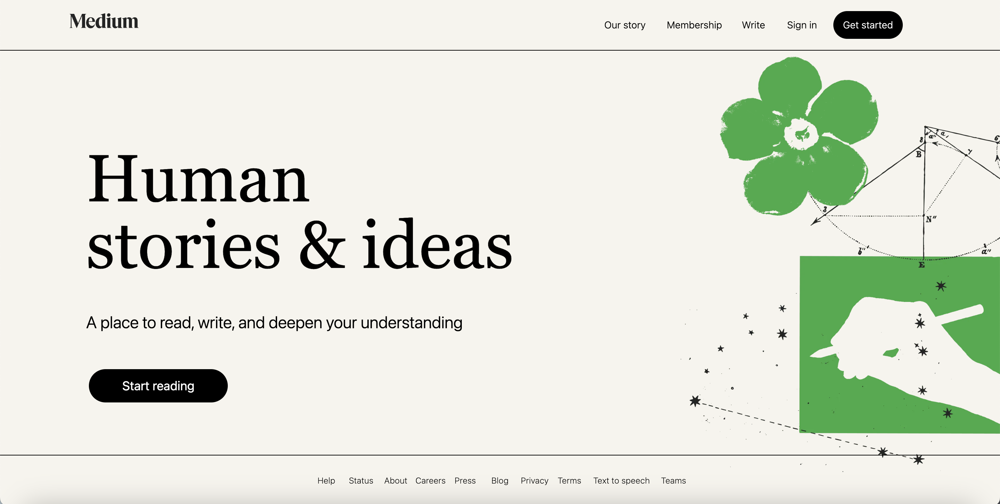

# Medium Clone

This is a clone of the Medium website. It is a multi page website that uses React Router for navigation and routing. 

### Tech Stack 
- Languages: TypeScript, HTML, CSS
- Frameworks: React, TailWindCSS
- Libraries: React Router

### Install Instructions
1. Clone this repository
2. ```cd medium-clone```
3. ```npm install```
4. ```npm run dev```

### Preview 



### Improvements
1. Implement Signin using Google OAuth
2. Implement the Articles Page
